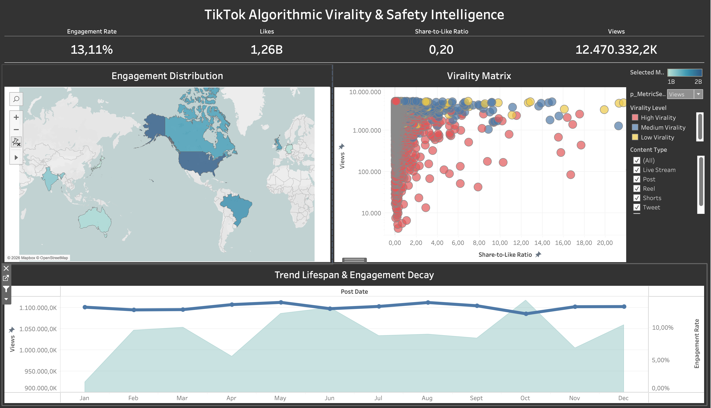
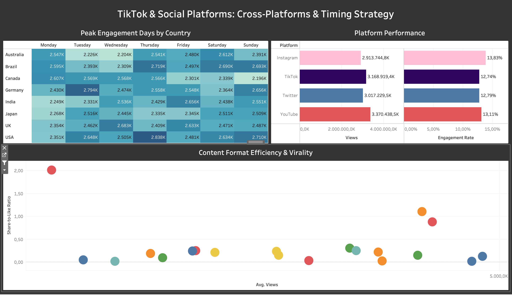

# 📊 TikTok Algorithmic Virality & Safety Intelligence

[](https://public.tableau.com/app/profile/anna.kuksa)
[](#-dataset--scope)
[](#)

An interactive Tableau analytical dashboard designed to uncover the structural drivers of video virality, user engagement dynamics, and content safety patterns on TikTok.




---

## 🎯 Executive Summary

Understanding what turns standard video content into a viral sensation is critical for content strategists, brand managers, and trust & safety teams. This project evaluates multi-year social media data to identify:
1. The **underlying algorithmic triggers** that drive massive reach across platforms.
2. The concept of **"Dark Virality"** — identifying potentially risky or harmful trends based on abnormal share behavior.
3. Cross-platform performance benchmarks and global publishing timing optimization.

---

## 💡 Key Analytical Insights

* **The Share-to-Like Ratio Driver:** While likes serve as a baseline for viewer interest, **private messaging shares (`Share-to-Like Ratio`) act as the core catalyst** for TikTok's recommendation engine.
* **Virality Threshold:** Videos with a `Share-to-Like Ratio` exceeding **20%** consistently break out of local audience clusters and enter high-tier exposure (>1M–10M views).
* **Dark Virality & Safety Detection:** Content with extreme share spikes (40–160+ shares per like, or ratio >0.3) often correlates with controversial, POV, or challenge-based content. Monitoring this metric allows early detection before formal content moderation kicks in.
* **Geographic Posting Windows:** Optimal engagement days and hours vary significantly across target markets (USA, Germany, UK, Brazil, etc.), requiring localized content scheduling.
* **Platform Performance Trade-offs:** While YouTube leads in overall reach volume, Instagram achieves higher average engagement rates, and TikTok delivers balanced high performance across both views and interaction rates.

---

## 📈 Dashboard Architecture & Metrics

### 1. Virality & Safety Intelligence Dashboard
* **KPI Cards:** Macro-level summary tracking `Engagement Rate (13.11%)`, `Likes (1.26B)`, `Share-to-Like Ratio (0.20)`, and `Views (12.47B)`.
* **Geo Virality Map:** Spatial analytics tracking view distribution and audience engagement across global markets.
* **Virality Matrix (Scatter Plot):** Correlates `Total Views` (logarithmic scale) with `Share-to-Like Ratio` to highlight high-risk outlier content.
* **Trend Lifespan & Safety Decay:** Time series visualization displaying view volumes against engagement decay over time.

### 2. Strategic Content & Timing Optimization Dashboard
* **Peak Posting Days (Heatmap):** Cross-tabulation identifying peak audience activity windows by country and day of week.
* **Platform Analytics:** Comparative bar charts evaluating reach and engagement across TikTok, Instagram, YouTube, and Twitter.
* **Content Virality Scatter:** Breakdown of performance across specific content formats (Shorts, Reels, Posts, Live Streams).

---

## 📊 Dataset & Scope

* **Timeframe:** 2021–2023 (Serves as a robust historical baseline for algorithmic behavior analysis).
* **Geographic Coverage:** 8 key global markets — *USA, Germany, Brazil, United Kingdom, India, Japan, Australia, Canada*.
* **Grain:** Individual post/video record level (`Post ID`).
* **Note on China:** TikTok operates exclusively outside Mainland China. ByteDance runs a separate domestic platform, **Douyin**, with isolated servers, user bases, and compliance algorithms.

---

## 🛠️ Tools & Tech Stack

* **Business Intelligence:** Tableau Public / Tableau Desktop (Advanced Container Layouts, Dual-Axis Charts, Logarithmic Scaling, Parameter Controls, Filter Actions).
* **Data Processing & Prep:** Python (Pandas), SQL (Data cleaning, schema structuring, aggregation).
* **Version Control:** Git & GitHub.

---

## 🔗 Live Interactive Dashboards

🔗 **[View Full Interactive Dashboards on Tableau Public](https://public.tableau.com/app/profile/anna.kuksa)**

---

## 📂 Repository Structure

```text
.
├── 1_dashboard_preview.png                          # Virality & Safety Matrix Preview
├── 2_dashboard_preview.png                          # Trend Lifespan & Performance Analytics Preview
├── TikTok Algorithmic Virality & Safety Intelligence.twbx # Packaged Tableau Workbook
├── .gitignore                                       # Git ignore rules
└── README.md                                        # Project documentation & analytical breakdown


👤 Author
Anna Kuksa — Data Analyst / Analytics Engineer
🐙 GitHub: @anna-data-code
📊 Tableau Public: [Profile](https://public.tableau.com/app/profile/anna.laptiieva)
