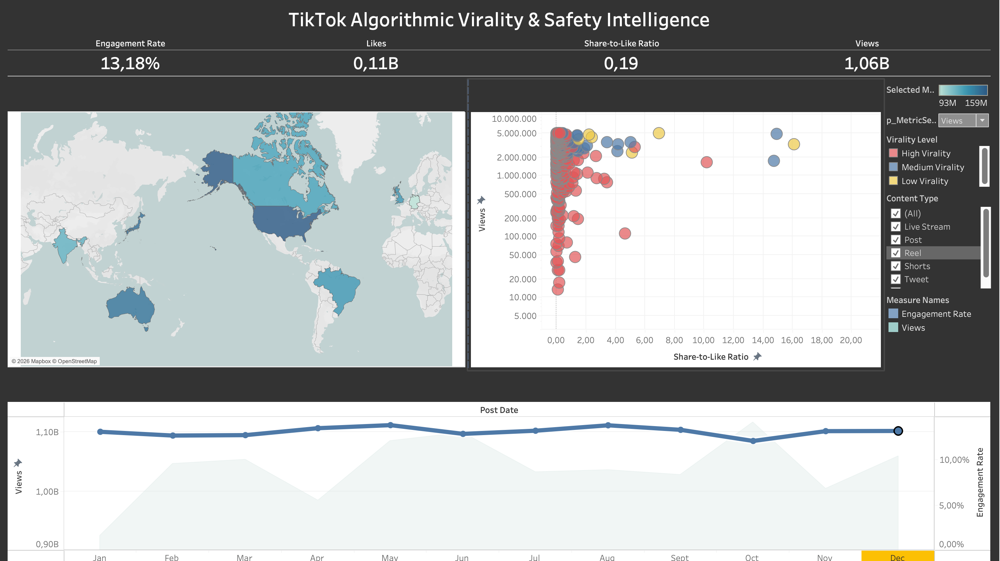

# 📊 TikTok Algorithmic Virality & Safety Intelligence

[](https://public.tableau.com/app/profile/anna.kuksa)
[](#-dataset--scope)

An interactive Tableau analytical dashboard designed to uncover the structural drivers of video virality, user engagement dynamics, and content safety patterns on TikTok.



---

## 🎯 Executive Summary

Understanding what turns standard video content into a viral sensation is critical for content strategists, brand managers, and trust & safety teams. This project evaluates multi-year social media data to identify:
1. The **underlying algorithmic triggers** that drive massive reach.
2. The concept of **"Dark Virality"** — identifying potentially risky or harmful trends based on abnormal share behavior.
3. Cross-platform performance benchmarks and global publishing timing optimization.

---

## 💡 Key Analytical Insights

* **The Share-to-Like Ratio Driver:** While likes serve as a baseline for viewer interest, **private messaging shares (`Share-to-Like Ratio`) act as the core catalyst** for TikTok's recommendation engine.
* **Virality Threshold:** Videos with a `Share-to-Like Ratio` exceeding **20%** consistently break out of local audience clusters and enter high-tier exposure (>1M–10M views).
* **Dark Virality & Safety Detection:** Content with extreme share spikes (40–160+ shares per like) often correlates with controversial, POV, or challenge-based content. Monitoring this metric allows early detection before formal content moderation kicks in.
* **Geographic Posting Windows:** Optimal engagement days and hours vary significantly across target markets (USA, Germany, UK, Brazil, etc.), requiring localized content scheduling.

---

## 🔗 Live Interactive Dashboards

🔗 **[View Full Interactive Dashboards on Tableau Public](https://public.tableau.com/app/profile/anna.kuksa)**

---

## 📂 Dataset & Scope

* **Timeframe:** 2021–2023 (Serves as a robust historical baseline for algorithmic behavior analysis).
* **Geographic Coverage:** 8 key global markets — *USA, Germany, Brazil, United Kingdom, India, Japan, Australia, Canada*.
* **Note on China:** TikTok operates exclusively outside Mainland China. ByteDance runs a separate domestic platform, **Douyin**, with isolated servers, user bases, and compliance algorithms.

---

## 🛠️ Tools & Tech Stack

* **Business Intelligence:** Tableau Public / Tableau Desktop (Advanced Container Layouts, Dual-Axis Charts, Logarithmic Scaling, Parameter Controls, Filter Actions).
* **Data Processing & Prep:** Python, SQL (Data cleaning, schema structuring, aggregation).
* **Version Control:** Git & GitHub.

---

## 📁 Repository Structure

```text
├── README.md                          # Project documentation & analytical breakdown
├── TikTok_Virality_Dashboard.twbx     # Packaged Tableau Workbook
└── dashboard_preview.png              # High-resolution dashboard screenshot
